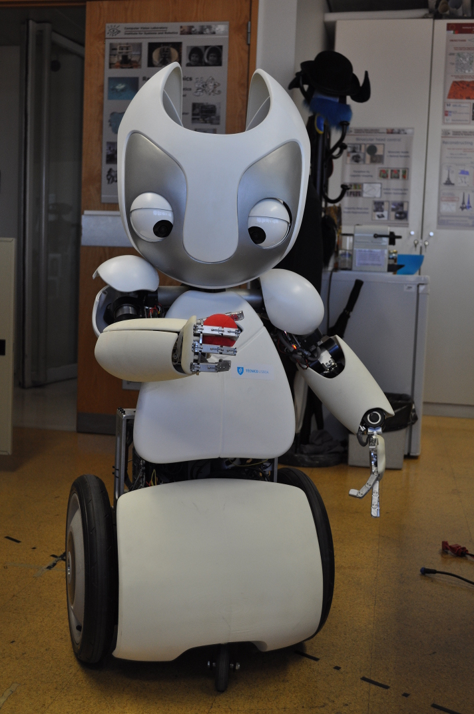

# vizzy

This is Vizzy's "oh so amazing" repository!

This repository contains the necessary tools to interact with Vizzy - both on simulation and real robot usage.

The real robot uses two different middlewares for distinct body parts (YARP for the upperbody and ROS for the mobile base). In simulation there are two options in terms of middleware - one aligned with the real robot (using YARP and ROS) and one aiming simulation experiences (using exclusively ROS).

## Packages Description

* [vizzy_launch](vizzy_launch): Contains the launch files to interact with Vizzy (both on simulation and real robot usage). For most users it is the only package they need to directly use.
* [vizzy_description](vizzy_description): Contains all of Vizzy's description files (regarding mechanical, kinematic, visual, etc). You can use its launcher called `display.launch` to check the model with the Rviz graphical tool.
* [vizzy_gazebo](vizzy_gazebo): Holds the launch files needed to simulate the robot on the GAZEBO simulator.
* [vizzy_navigation](vizzy_navigation): Contains the launch files for several packages of the ROS navigation stack.
* [vizzy_control](vizzy_control): Low-level controllers for Vizzy's simulation.
* [vizzy_sensors](vizzy_sensors): Package holding the Hokuyo filters for better scannings.
* [vizzy_yarp_icub](vizzy_yarp_icub): YARP based controllers, drivers, libraries and modules. Cartesian controllers, gaze controller, ball tracker grasping demo, yoga demo.

## Environment

Note that for simulation purposes one can ignore all YARP dependencies as explained on the repository description.

* Operating System (one of the two)
  * [Ubuntu 12.04](http://releases.ubuntu.com/12.04/) - Deprecated !!! forces the user to install ROS Hydro that currently is able to run everything
  * [Ubuntu 14.04](http://releases.ubuntu.com/14.04/) - forces the user to install [ROS Indigo](http://wiki.ros.org/indigo/Installation/Ubuntu) that is the fully functional and currently supported version
  * [Ubuntu 16.04](http://releases.ubuntu.com/16.04/) - We are currently in the process of migrating to Ubuntu 16.04 and ROS Kinetic-Kame
* Middleware
  * [ROS](http://www.ros.org/) - depending on the installed OS (Hydro for Ubuntu 12.04, Indigo for Ubuntu 14.04 or Kinetic for 16.04)
  * [YARP](http://wiki.icub.org/yarpdoc/) - we try to keep everything working with the most recent version of YARP
* Other Dependencies
  * [GAZEBO](http://gazebosim.org/) - It needs GAZEBO 5 to run the gazebo-yarp-plugins. Currently tested in Gazebo 7.
  * [gazebo-yarp-plugins](https://github.com/robotology/gazebo-yarp-plugins) - we try to keep everything working with the most recent version of gazebo-yarp-plugins

At any time you might need to install some more specific dependencies (like some missing ROS packages). Please open an issue in case you can't solve these or other dependencies.

## Download and Setup

You should have a catkin workspace on your file system to be able to compile the code. If you don't know how to do this please follow [these instructions](http://wiki.ros.org/catkin/Tutorials/create_a_workspace).

As soon as you have your catkin_workspace configured you are ready to open a terminal and run the following instructions:

    cd /path/to/your/catkin/workspace/src
    git clone https://github.com/vislab-tecnico-lisboa/vizzy

Be sure to add the source folder of your catkin workspace to the `ROS_PACKAGE_PATH` variable (skip this step if you already did it):

    gedit ~/.bashrc

Add the following line to the end of the file:

    export ROS_PACKAGE_PATH=/path/to/your/catkin/workspace/src:$ROS_PACKAGE_PATH

Save the file and run:

    source ~/.bashrc

You still need to add something to the `GAZEBO_MODEL_PATH`:

    gedit ~/.bashrc

(Yeah I know we could have done this on the previous step but I was afraid people would skip the last step without noticing this `export`...sorry)

    export GAZEBO_MODEL_PATH=/path/to/your/catkin/workspace/src/vizzy/vizzy_gazebo:$GAZEBO_MODEL_PATH

Save the file and run:

    source ~/.bashrc

Install the nav2d package
  
    version=kinetic &&
    sudo apt-get install ros-$version-nav2d

If you want to run the follower module, download a changed version of the nav2d and place it in your catkin workspace folder

    git clone https://github.com/joao-avelino/navigation_2d.git

We are currently migrating the eband planner to teb planner.

Other dependencies needed (in a convenient one-liner)
    
    version=kinetic &&
    sudo apt install ros-$version-gazebo-* &&
    sudo apt install ros-$version-moveit-* &&
    sudo apt install ros-$version-opencv* &&
    sudo apt install ros-$version-image-proc && 
    sudo apt install ros-$version-gazebo-ros-control &&
    sudo apt install ros-$version-move-base &&
    sudo apt install ros-$version-amcl &&
    sudo apt install ros-$version-joy &&
    sudo apt install ros-$version-map-server &&
    sudo apt install ros-$version-joint-state-controller &&
    sudo apt install ros-$version-velocity-controllers &&
    sudo apt install ros-$version-position-controllers &&
    sudo apt install ros-$version-joint-trajectory-controller &&
    sudo apt install ros-$version-eband-local-planner &&
    sudo apt install ros-$version-laser-filters &&
    sudo apt install libsuitesparse-dev &&
    sudo apt install ros-$version-fake-localization &&

You are now ready to compile the code!

## Compile

The compilation is quite straightforward. Just open a terminal:

    cd /path/to/your/catkin/workspace
    catkin_make --pkg vizzy_msgs
    catkin_make --pkg id_selector
    catkin_make

Hmm... does this seems to easy? I hope it does because you should now be ready to interact with Vizzy!

## Run

For now let's focus on simulation. Open a terminal:

    roslaunch vizzy_launch vizzy_simulation.launch

This configuration starts Vizzy in the ROS-mode, meaning that all the controllers are emulated using ROS. This configuration works only with Gazebo 2.x and ROS indigo (The default install procedure of ROS indigo)

The upper body controllers simulated by the [gazebo-yarp-plugins](https://github.com/robotology/gazebo-yarp-plugins) can be started by

    yarpserver
    roslaunch vizzy_launch vizzy_simulation.launch use_yarp:=true

Don't forget you'll need to have `yarpserver` running when you have the `use_yarp` argument set as true.

Feel free to play with the arguments as you want or to change the low-level launchers with more functionality.

## AUDIO (ON REAL VIZZY)

# First time configuration

To access pulseaudio and all the sound options through the network you need to make it discoverable. For that use:

    paprefs
    
Add the vizzy user to the audio group

    sudo usermod -aG audio,pulse,pulse-access `whoami`

In order to access the audio configurations via SSH you need to define the the following environment variable on Vizzy:

    export PULSE_SERVER=127.0.0.1

Furthermore, without a X11 session the PulseAudio server will not launch automatically since it normally requires X11. To run PulseAudio in a headless machine you need to run it in daemon mode:

    pulseaudio -D

This should be launched automatically, but if the audio is not working you should check if the pulseaudio server is running. If not, execute the previous command and it should work.

To control the audio volume use

    alsamixer

Now you can access audio configurations via ssh -X. Useful commands:

    gnome-control-center
    pavucontrol
    pacmd

## Documentation
For more details see the following reference:

    @inproceedings{moreno2016vizzy,
      title={Vizzy: A humanoid on wheels for assistive robotics},
      author={Moreno, Plinio and Nunes, Ricardo and Figueiredo, Rui and Ferreira, Ricardo and Bernardino, Alexandre and Santos-Victor, Jos{\'e} and Beira, Ricardo and Vargas, Lu{\'\i}s and Arag{\~a}o, Duarte and Arag{\~a}o, Miguel},
      booktitle={Robot 2015: Second Iberian Robotics Conference},
      pages={17--28},
      year={2016},
      organization={Springer}
     }

## Issues

All kind of issues and contributions will be very welcome. Please get in touch on [our issues page](https://github.com/vislab-tecnico-lisboa/vizzy/issues) when help is needed!
